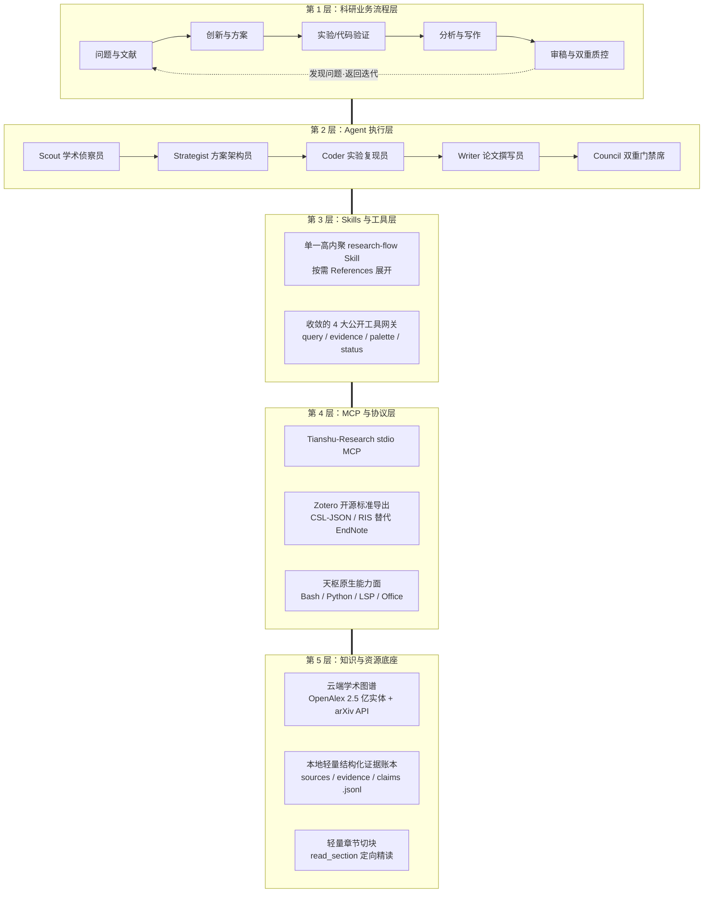

# Tianshu-Research (天枢理工科研能力扩展包)

[](LICENSE)
[](https://modelcontextprotocol.io/)
[](https://github.com/yq04/Tianshu-Research/actions)
[](test/)
[](package.json)
[](figure/)

天枢理工科研能力扩展包（**Tianshu-Research Overlay**）。Tianshu-Research 并非孤立臃肿的第三方科研 Agent，亦非单纯外挂的 MCP Server，而是依附于 **Tianshu-Harness**（天枢智能体运行时）的**第一方原生科研能力扩展包**。

项目秉持天枢的核心哲学——**“一套科研内核，两个交互表面；Harness 负责思考与编排，Research 负责测量、存证与科学验收”**。通过收敛公开工具网关、结构化证据账本（Evidence Ledger）与双重科学门禁（Scientific Gate），在运行时严格杜绝「虚构 DOI、用普通网页搜索冒充学术库、未读全文编造页码与实验数据」等大模型科研幻觉。

---

## 一、五层科研工作流全景吸收与工程边界

本项目全面吸收了现代科研工作流体系的核心精髓，并将其与天枢原生架构深度融合：



### 深度研判：吸收什么 vs 坚决摒弃什么

| 架构层级 | 工作流核心吸收点 (YES) | 坚决摒弃的过度设计与陷阱 (NO) | 决策依据与工程边界 |
| :--- | :--- | :--- | :--- |
| **第 1 层：业务流程层** | **完全吸收五阶段闭环体系**：从文献初筛、方案假说、代码实验、图表撰写到双重门禁质控，支持全生命周期闭环迭代。 | 摒弃“一刀切必须走完 5 阶段”的僵化流程；保留短用（秒查即弃）、中用（精读卡）、长用（账本门禁）三档弹性。 | 满足不同研究深度需求，避免轻量学术查询产生沉重流程包袱。 |
| **第 2 层：Agent 执行层** | **系统化映射为天枢原生的 WorkOrder 角色模板**（Scout, Strategist, Coder, Writer, Gatekeeper），通过宿主原生的 `/team` 与 `/council` 分波调度。 | **坚决不在插件内新造 5 套割裂的 Agent 运行时**；避免多进程重复通信开销与独立的调度器混乱。 | 宿主已具备顶级的认知虚拟机（CVM）与多智能体分波引擎，插件专注做好“量具与门禁”。 |
| **第 3 层：Skills 工具层** | **坚守单一高聚合 Skill（`research-flow`）**，内部以按需 References 下钻；工具面**严格收敛为 4 大公开网关**。 | **坚决不拆分成 8 个独立 Skill 塞入环境**；严禁把细碎小动作暴露为公开顶级工具。 | 严格保护 DeepSeek 前缀缓存！过多的细碎工具会稀释模型注意力、打碎 KV Cache 前缀指纹。 |
| **第 4 层：MCP 协议层** | 1. **全面拥抱开源 Zotero**：提供标准 CSL-JSON 与 RIS 导出动作，对接社区开源 `zotero-mcp`；<br>2. 写作与图表复用宿主已有环境与 Office 工具。 | **坚决摒弃商业闭源的 EndNote**；严禁在插件内重复造轮子实现 Code 或 Word 读写能力。 | 用户明确要求用 Zotero 替代 EndNote。宿主已有完备的系统级工具，保持插件纯净度。 |
| **第 5 层：知识与资源层** | **吸纳轻量 RAG 精髓**：<br>1. 全局检索依托 OpenAlex 2.5 亿学术图谱与 arXiv API；<br>2. 本地依托 Git 友好的结构化 JSONL 证据账本；<br>3. 章节切块（`read_section`）按需窄读取。 | **坚决不内嵌重型本地向量数据库（如 Chroma/LanceDB）**；严禁引入数百 MB 本地二进制 C++ / ONNX 依赖。 | 保持零外部二进制依赖与跨平台轻量性；结构化证据账本足以提供确定性物理定位与零幻觉 Grounding。 |

---

## 二、收敛的 4 大公开工具网关

所有底层能力（检索、单篇解析、材料切块、证据账本、科学门禁、图表配色）统一收敛至 4 个 Discriminated Union 工具网关，公开工具 Schema 预算严格控制在约 850 tokens：

1. **`research_query` (统一学术检索与单篇解析网关)**
   - `action: "search_papers"`：并发检索 arXiv 与 OpenAlex 开放文献。
   - `action: "resolve_paper"`：按 arXiv ID、abs/pdf 链接或 DOI 查询单篇文献元数据，直链 OA PDF 与官方 HTML。

2. **`research_evidence` (结构化证据账本、章节精读与科学门禁网关)**
   - `action: "ingest_document"`：导入纯文本/HTML 论文材料至工作区（安全单段 docId，拒绝二进制 PDF 混入），建立全文 Grounding 基准。
   - `action: "read_section"`：按章节定向提取已入库材料（默认截断至 2000 字符内，支持 offset 分页），**严格压制上下文暴涨，将单轮精读交互注入的 token 量从 2.5 万压制至 1000 以内**。
   - `action: "add_source"`：录入参考文献元数据。
   - `action: "add_evidence"`：记录包含真实物理 Locator（章节、行号、字符区间或已核实页码）与原文摘录的证据片段。
   - `action: "add_claim"`：基于已录入证据创建科学主张，建立双向追踪链。
   - `action: "query_evidence"`：按来源、支持/反驳关系或关键词检索证据片段。
   - `action: "get_summary"`：统计当前工作区账本整体规模。
   - `action: "verify_ledger"`：执行科学门禁审查（默认 90% Locator 覆盖门槛、全文 Grounding 摘录匹配、小枚举支持关系、占位符拦截）。
   - `action: "export_csl_json"`：将账本数据导出为国际标准 Citation Style Language JSON 格式（`.rivet/research/export/literature.csl.json`）。
   - `action: "export_ris"`：将账本数据导出为通用 Research Information Systems 格式（`.rivet/research/export/literature.ris`），一键拖入 Zotero。

3. **`journal_palette` (顶刊出版规范配色网关)**
   - 查询 100 套顶刊出版规范配色（Nature, Science, IEEE, ColorBrewer, Okabe-Ito 色盲友好色板）。内存即时计算，零依赖。

4. **`research_status` (科研工作区状态诊断)**
   - 快速获取当前工作区路径、证据账本统计（Sources/Evidence/Claims）、检索引擎配置与顶刊色板角色目录。

---

## 三、真实实测四大隐患治理与生产级防护

在实机 DeepSeek-V4 长会话测试中，我们深入剖析了遥测日志，落地了四大针对性防护：

### 1. 防 20 万 Token 撑爆机制（DeepSeek 缓存友好）
- **现象**：大模型对话历史具有单调累积性。若模型用 bash 或 `read_file` 把上百 KB 的整篇论文全量回显至对话，单会话上下文十余轮即从 3.3 万暴涨至 20.7 万 tokens（Prompt 累计达 651 万 tokens），导致首字延迟（TTFT）恶化至 3.5s ~ 5.6s。
- **治理**：引入 `read_section` 窄动作，并在 Skill 中确立纪律：长文必须静默存盘后定向读取目标章节（单次限 2000 字符），将单轮增量压缩 95% 以上，真正发挥 DeepSeek 95%~99% 前缀缓存命中率的高吞吐优势。

### 2. 外部学术源防风控与限流保护
- **OpenAlex 礼貌池接入**：在 `search.js` 中自动注入 `&mailto=` 参数（支持 `OPENALEX_MAILTO` 环境变量，缺省合规回退），接入官方 10 req/s 的 Polite Pool；可选支持 `OPENALEX_API_KEY`。
- **arXiv 3 秒节流调度器**：内置基于内存 Promise 的队列调度器，强制发往 arXiv 的请求间隔严格 `>= 3000ms`，杜绝突发流量封禁。
- **优雅降级**：结构化捕获 429 与 403 异常并输出友好提示，保证并发检索时单源失败不崩溃。

### 3. TUN 代理 Fake-IP (198.18.0.0/15) 避坑
- **现象**：Windows 下 Clash / Mihomo 等 TUN 代理会将境外学术域名解析为 198.18.x.x 假网段，触发宿主内核的 SSRF 安全防御。
- **治理**：在学术卡片中自动提供 arXiv 原生在线阅读直链（`- html: https://arxiv.org/html/<id>`）；在 Skill 中规范静默脚本下载后导入，禁止盲目重试 `web_fetch`。

### 4. 项目级配置隔离与日常使用零干扰 (Zero-Pollution Guide)
- **为什么不推荐全局常驻？** 全局常驻会占用约 850 tokens 的 System Prompt 工具定义，分散常规编程注意力；若在会话中途开关 MCP，工具集的变动会打碎 System Prompt 前缀指纹，摧毁 DeepSeek KV 缓存。
- **推荐方案**：遵循「项目级配置优先于全局配置」哲学，仅在科研工程根目录下配置 `.rivet-config.json`：
  ```json
  {
    "mcpServers": {
      "tianshu-research": {
        "command": "node",
        "args": ["D:/1_Research/Develop_Research/plugins/tianshu-research/mcp-server.js"]
      }
    }
  }
  ```
  日常通用编程项目保持纯净的 26 个核心工具面，实现 **0 额外 Token 消耗、0 缓存抖动、0 注意力干扰**。

---

## 四、Zotero 现代文献生态对接（替代 EndNote）

本项目全面对接开源 **Zotero** 生态，彻底告别商业闭源的 EndNote（详见 [docs/zotero-integration.md](docs/zotero-integration.md)）：

1. **一键导出标准格式**：
   - 导出 CSL-JSON：`research_evidence(action="export_csl_json")`
   - 导出 RIS：`research_evidence(action="export_ris")`
2. **导入 Zotero 客户端**：打开 Zotero 点击 **文件 → 导入 → 选择 .rivet/research/export/literature.ris** 即可秒级结构化入库。
3. **对接社区 `zotero-mcp`**：支持直接通过标准 MCP 协议与本地 Zotero 知识库进行双向检索与条目同步。

---

## 五、五阶段多 Agent 闭环与双重科学门禁

基于天枢原生的 `/team` 与 `/council` 编排器，提供开箱即用的五阶段协作流水线（详见 [references/team-templates.md](skills/research-flow/references/team-templates.md)）：

1. **Wave 1: Scout (学术初筛员)**：初筛 OA 论文，提取真实 DOI 与 arXiv ID。
2. **Wave 2: Strategist (方案架构员)**：分析 Research Gap，提炼创新假设与数值验证方案。
3. **Wave 3: Coder (实验复现员)**：编写并运行仿真算法代码，验证 Exit 0。
4. **Wave 4: Writer (学术撰写员)**：应用 `journal_palette` 顶刊配色，撰写论文草稿并导出 CSL-JSON/RIS。
5. **Wave 5: Council Gatekeeper (双重科学门禁席)**：
   - **一级证据链门禁**：核验 100% Locator 覆盖与全文 Grounding 真实匹配。
   - **二级代码复现门禁**：独立复跑核心实验脚本验证数值一致性；未通过闭环打回前序 Wave 迭代。

---

## 六、Python 绘图伴生库

将 `figure/journal_palette.py` 与 `figure/journal_palette.json` 放置于用户绘图脚本同级目录：

```python
import matplotlib.pyplot as plt
import numpy as np
from journal_palette import journal_palette, apply_journal_style

# 应用顶刊排版规范 (Nature / Science 风格)
apply_journal_style()

# 获取色盲友好色板 (Okabe-Ito)
colors = journal_palette('colorblind')

fig, ax = plt.subplots(figsize=(6, 4))
x = np.linspace(0, 10, 100)
for i in range(len(colors)):
    ax.plot(x, np.sin(x + i * 0.5), color=colors[i], label=f'Series {i+1}')

ax.set_title("Journal Figure Demonstration")
ax.legend(loc='upper right', frameon=False)
plt.show()
```

---

## 七、快速开始 (Quickstart)

### 方式 A：作为独立 stdio MCP 服务运行
```bash
# 启动 MCP 服务 (JSON-RPC 2.0 stdio)
node mcp-server.js
```

### 方式 B：在天枢 CLI 中使用
```bash
# 1. 快捷检查科研工作区状态
/research-status

# 2. 启动科研检索初筛
/research physics-informed neural networks
```

### 方式 C：在天枢桌面端 (Tauri) 启用
进入桌面端 **Settings → MCP 服务 →「科研文献」→ 点击启用**。

---

## 八、自动化测试与质量指标

项目包含严谨完备的自动化测试套件，坚守通过即止（Stop on Green）纪律：

```bash
# 运行全量 Node.js 单元测试（86 项测试全部 100% GREEN）
node --test test/*.test.js

# 运行 Python 色板插值与样式单测（6 项断言全部通过）
python test/test_journal_palette.py
```

---

## 九、目录结构全景

```text
Tianshu-Research/
├── .github/
│   └── workflows/
│       └── ci.yml                   # GitHub Actions 持续集成自动化测试
├── commands/
│   ├── research.md                  # /research 斜杠指令
│   └── research-status.md           # /research-status 诊断指令
├── compute/
│   ├── compute-gateway.js           # 渐进式科学计算网关
│   └── sympy_runner.py              # SymPy 符号代数执行器
├── docs/
│   ├── smoke.md                     # 冒烟测试手册
│   ├── tianshu-research-capability-map.md # 顶层全景架构地图与全链路设计
│   ├── tianshu-research-plan.md     # 架构规划案
│   └── zotero-integration.md        # Zotero 与 zotero-mcp 现代文献对接指南
├── document/
│   └── document-parser.js           # 科学文档章节切块与真实物理 Locator 解析
├── figure/
│   ├── journal_palette.json         # 100 套顶刊出版色板数据
│   └── journal_palette.py           # Python 顶刊绘图伴生库
├── gates/
│   └── scientific-verifier.js       # 科学门禁审计器 (Evidence Ledger 闭环校验)
├── jobs/
│   └── job-manager.js               # 异步长时间任务状态机
├── ledger/
│   └── evidence-ledger.js           # 结构化证据账本核心读写与 CSL-JSON/RIS 导出
├── skills/
│   └── research-flow/
│       ├── SKILL.md                 # 智能体科研工作流技能规范 (防撑爆与避坑指南)
│       └── references/
│           ├── cvm-reflective-flow.md # CVM 反思型科研工作流实战模版
│           ├── reading-card.md       # 精读卡规范
│           ├── polishing.md          # 学术润色不变量保护规范
│           └── team-templates.md     # 五阶段科研多 Agent 协作与双重门禁模版
├── test/
│   ├── arxiv-sample.xml             # 离线 Atom 样卷
│   ├── compute.test.js              # 符号计算单测
│   ├── document.test.js             # 文档解析与真实定位单测
│   ├── gateway.test.js              # 网关工具单测 (包含 read_section 与导出)
│   ├── job.test.js                  # 异步任务单测
│   ├── ledger.test.js               # 证据账本、CSL-JSON 与 RIS 导出单测
│   ├── mcp-server.test.js           # MCP JSON-RPC 2.0 协议一致性测试
│   ├── search.test.js               # arXiv / OpenAlex 解析与 3s 节流单测
│   └── test_journal_palette.py      # Python 色板单测
├── tools/
│   └── research-status.js           # 状态诊断工具实现
├── figure.js                        # Node 端色板插值与角色查询
├── gateway-document.js              # 文档解析网关内部实现
├── gateway-evidence.js              # 证据账本与章节精读公开网关
├── gateway-job.js                   # 异步任务网关内部实现
├── gateway-query.js                 # 学术检索公开网关
├── index.js                         # 插件导出入口
├── mcp-server.js                    # 标准 stdio MCP 协议服务
├── package.json                     # 模块清单
├── search.js                        # 学术文献检索、礼貌池与节流实现
├── tool-contracts.js                # 收敛的 4 大工具契约与 Schema 校验
├── HANDOFF.md                       # 综合交接文档 (写给无上下文的后续开发者)
├── THIRD_PARTY_NOTICES.md          # 第三方开源声明
├── LICENSE                          # Apache-2.0
└── README.md                        # 项目全景说明
```

---

## 十、许可证与致谢

- 本项目遵循 [Apache-2.0](LICENSE) 许可证。
- 色板数据整理自 ColorBrewer 2.0 (Apache 2.0)、Okabe-Ito (CC0) 及公开科研绘图规范，详见 [THIRD_PARTY_NOTICES.md](THIRD_PARTY_NOTICES.md)。
- 学术数据接口来自 [arXiv API](https://arxiv.org/help/api) 与 [OpenAlex API](https://openalex.org/)。
