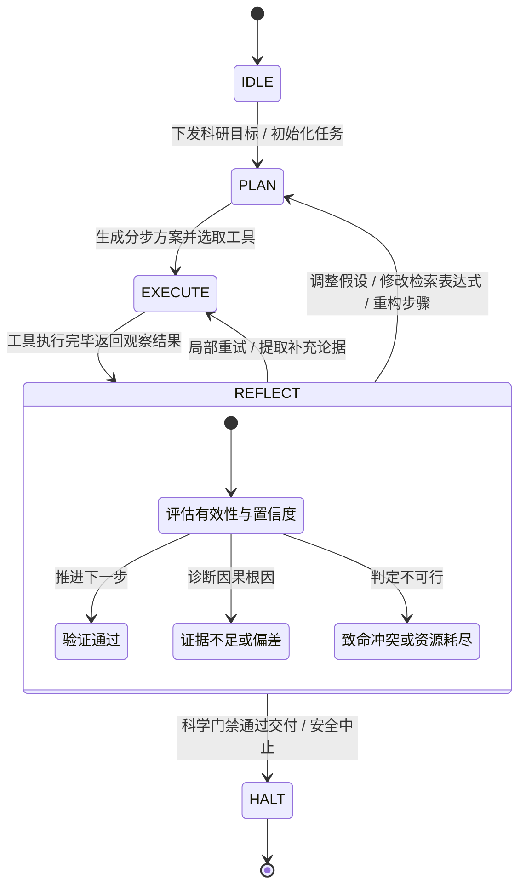

# 基于认知虚拟机 (CVM) 的科研执行与因果反思规约 (CVM Reflective Flow Specification)

> **理论渊源**：吸收自 *From Tool to Partner: How Tianshu-Harness and Cognitive VMs Are Redefining the AI Agent Loop* 与天枢 CVM 认知虚拟机架构内核。
> **定位准则**：在理工科科研探索中，彻底摒弃朴素脆弱的「while 循环 + 工具调用」堆砌模式，将天枢认知虚拟机的**状态机调度**、**显式反思循环 (Reflective Loop)**、**内存分层 (Memory Stack)** 与**因果追踪 (Causal Trace)** 贯彻至科研探索全生命周期。

---

## 1. 传统 Agent 循环的科研失灵与 CVM 范式转移

传统的 LLM Agent 普遍依赖朴素的控制流（`while !is_final_answer { call_tool(); append_history(); }`）。在严谨的理工科科研任务中，该模式必然遭遇三大工程崩溃点：

### 1.1 状态黑洞与上下文污染 (State Opacity in Recursive Contexts)
- **痛点**：在长篇文献阅读、章节翻查与数值推导中，扁平累加的对话历史会迅速耗尽上下文窗口。无关的次要文字、表格格式噪声挤占有效 Token 预算，导致模型发生“服从性漂移（Compliance Drift）”，遗忘初始科研假设或错失关键约束。
- **CVM 破局**：引入结构化内存栈（Memory Stack），解耦短期注意力与长期知识，实现物理外挂证据与分段精读。

### 1.2 终止条件脆弱与虚假收工 (Break Condition Fragility)
- **痛点**：二元终止条件（仅靠 `is_final_answer` 或字符串匹配）极其脆弱。面对模糊文献、冲突实验数据或计算误差时，Agent 极易陷入两极：要么出现“幻觉收工（Hallucinated Completion）”（捏造文献或强行宣布结论已验证），要么陷入“循环麻痹（Loop Paralysis）”（重复用同一关键词发起无意义搜索）。
- **CVM 破局**：显式状态机调度（FSM），将状态流转与门禁判断交由确定性控制单元驱动。

### 1.3 调试黑箱与因果缺失 (Debugging Black Box)
- **痛点**：当综述结论出现硬伤或公式推导错误时，传统方案仅留下一堆散乱的 HTTP 交互日志，无法回溯决策因果链：究竟是检索词偏差？文献原文断章取义？量纲代换疏忽？还是推导逻辑跳跃？
- **CVM 破局**：结构化因果追踪（Causal Trace），为每一次认知跃迁提供带语义解释与置信度的“认知调用栈（Cognitive Stack Trace）”。

---

## 2. CVM 认知虚拟机的三层架构在科研场景的映射

```mermaid
flowchart TB
    subgraph ControlUnit [CVM 控制单元 (Control Unit)]
        FSM[认知状态机: IDLE -> PLAN -> EXECUTE -> REFLECT -> HALT]
        Policy[决策图谱 / 动态分支 / 回退策略]
    end

    subgraph MemoryStack [CVM 内存栈 (Memory Stack)]
        WM[工作记忆: 当前注意力窗口 & 单章切片]
        SM[语义记忆: arXiv/OpenAlex 索引 & sources.jsonl & 物理常数]
        EM[情景记忆: evidence.jsonl & claims.jsonl & events.jsonl]
    end

    subgraph Sandbox [执行沙箱 (Execution Sandbox)]
        GWQ[research_query: 文献初筛]
        GWD[research_document: 定位精读]
        GWC[research_compute: 量纲/容差验证]
        GWE[research_evidence: 证据与门禁]
        GWJ[research_job: 异步状态机]
    end

    ControlUnit --> Sandbox
    Sandbox --> MemoryStack
    MemoryStack --> ControlUnit
```

### 2.1 内存栈 (Memory Stack) 映射

| 内存层级 | 对应科研实体与载体 | 生命周期与容量策略 | 典型访问模式 |
|---|---|---|---|
| **工作记忆 (Working Memory)** | 活跃提示词、当前单轮任务目标、正在分析的章节文本切片（`research_document read_section`） | 轮次级/瞬时；严格限制单次装载 < 10k Tokens，阅后即焚或压缩 | 短期高频推理、当前推导步骤演算 |
| **语义记忆 (Semantic Memory)** | 开放获取文献元数据（arXiv / OpenAlex）、`sources.jsonl`、SI 物理量纲定义与常数库 | 任务级/长效只读；通过关键词或 DOI 索引召回 | 按需精确命中，严禁将全量元数据或整库倾倒至会话 |
| **情景记忆 (Episodic Memory)** | 物理定锚证据表（`evidence.jsonl`）、科学主张图谱（`claims.jsonl`）、因果追踪日志（`events.jsonl`） | 跨轮次/项目持久化；结构化追加写入，不可随意篡改 | 科学门禁审计（`verify_ledger`）、任务回溯诊断、多 Agent 工单交接 |

### 2.2 控制单元 (Control Unit)
- 不再盲目“循环直到结束”，而是基于**决策图谱 (Decision Graph)** 驱动：具备分支探索、假设证伪、主动回退（Backtracking）与证据综合能力。

### 2.3 执行沙箱 (Execution Sandbox)
- 工具执行与外部调用必须经过隔离校验：输入参数经 `Discriminated Union` 严格白名单过滤，输出经过清洗与结构化裁剪，杜绝未经验证的脏数据或提示词注入直接污染认知中枢。

---

## 3. 状态机驱动的科研主循环与显式反思 (Reflective Loop)

CVM 核心将执行动作与结果评估**解耦为两个明确的阶段**：



### 科研四大显式反思触点 (Reflective Touchpoints)

在科研流程中，以下四类事件必须显式进入 `REFLECT` 状态，严禁无脑跳过评估直接执行下一步：

#### 触点 1: 检索反思 (Query Reflection)
- **触发条件**：`research_query` 召回篇数为 0，或返回的论文标题/摘要与预期领域出现明显偏差。
- **反思动作**：
  - 分析关键词空间：是否因为使用了过于冷门或专有的组合词？
  - 转移决策：`REFLECT -> PLAN`，调整检索式（如放宽布尔条件、使用同义术语替代，或切换 `arxiv` / `openalex` 数据源），禁止原地空转。

#### 触点 2: 精读与定位反思 (Extraction & Locator Reflection)
- **触发条件**：`research_document` 或阅读过程中发现作者未明确给出实验数据、或缺少关键物理定位凭证（页码、公式号、图表号）。
- **反思动作**：
  - 严守 Nature 级学术纪律：**材料不足即显式标明**，严禁脑补页码或编造结论。
  - 转移决策：若该论据为核心假设必须项，状态转移至 `REFLECT -> PLAN` 寻找替代文献；若为辅助论据，在账本中记录 `relation: "tentative"` 并附带因果理由。

#### 触点 3: 科学计算与量纲反思 (Compute Reflection)
- **触发条件**：`research_compute`（`dimension_check` 或 `numeric_eval`）报错或容差校验超标（如相对误差 > 1e-4）。
- **反思动作**：
  - 认知诊断：排查是物理量纲定义混淆（如把 MPa*m^(1/2) 误作 Pa*m）、量级换算遗漏，还是文献原文推导笔误。
  - 转移决策：`REFLECT -> REFLECT` 确认根本原因后，将计算偏差与诊断写入因果日志，`REFLECT -> PLAN` 修订推导路线。

#### 触点 4: 科学门禁反思 (Gate Reflection)
- **触发条件**：`research_evidence verify_ledger` 返回 `passed: false`（存在悬空引用、占位符残留或定位覆盖率 < 90%）。
- **反思动作**：
  - 提取阻断清单：定位具体的非法 `claimId` 或缺失定位的 `evidenceId`。
  - 转移决策：精准定向打回给对应的读者（Reader）补齐定位，或综合者（Synthesizer）剔除无支撑推测，直到门禁复核通过。

---

## 4. 因果追踪 (Causal Trace) 数据契约与认知栈诊断

为了让 Agent 的思考过程具备如软件工程般的**可观测性（Observability）**与**可审计性（Auditability）**，`research_job` 原生维护结构化因果追踪事件流。

### 4.1 事件结构契约 (Event Schema)

```typescript
interface CausalTraceEvent {
  event: string;                   // 事件名称 (e.g. 'status_update', 'plan_refined', 'verification_failed')
  status: string;                  // 当前任务状态 ('queued' | 'running' | 'completed' | 'failed' | 'cancelled')
  progress: number;                // 进度百分比 (0 - 100)
  timestamp: string;               // ISO-8601 UTC 时间戳
  message: string;                 // 人类可读进展摘要
  stateTransition?: string;        // 显式状态跃迁 (e.g. 'PLAN -> EXECUTE', 'EXECUTE -> REFLECT', 'REFLECT -> PLAN')
  action?: string;                 // 当前执行的具体科研动作 (e.g. 'search_papers', 'dimension_check', 'verify_ledger')
  confidence?: number;             // 置信度标量 (0.00 ~ 1.00)
  causalReason?: string;           // 状态跃迁或决策变更的因果解释 (Why did the agent make this transition?)
  metrics?: Record<string, any>;   // 运行时度量指标 (e.g. tokenUsage, matchCount, relativeError, locatorCoverage)
}
```

### 4.2 认知栈追踪 (Cognitive Stack Trace) 真实案例

当审查任务运行日志时，因果时间线可清晰还原智能体的推理纠偏链条：

```markdown
#### ⏱️ 事件与因果追踪 (Causal Trace Timeline)
- `[QUEUED]` `IDLE -> PLAN` [action: create_job]: Job initialized and queued (conf: 1) — *Reason: User initiated LEFM cryogenic analysis* *(2026-09-17T08:00:01Z)*
- `[RUNNING]` `PLAN -> EXECUTE` [action: search_papers]: Commenced literature retrieval (conf: 0.95) — *Reason: Formulated query focusing on Ti-6Al-4V fracture toughness* [metrics: {"target":3}] *(2026-09-17T08:00:05Z)*
- `[RUNNING]` `EXECUTE -> REFLECT` [action: dimension_check]: Dimension check executed (conf: 0.65) — *Reason: Unit mismatch detected: MPa*m^(1/2) expected, got Pa*m* [metrics: {"diffPowers":{"L":-0.5,"M":0,"T":0}}] *(2026-09-17T08:00:12Z)*
- `[RUNNING]` `REFLECT -> PLAN` [action: adjust_units]: Re-evaluating extraction equation (conf: 0.98) — *Reason: Located author definition of normalized stress intensity in section 2.1* *(2026-09-17T08:00:15Z)*
- `[RUNNING]` `PLAN -> EXECUTE` [action: verify_ledger]: Running scientific gate audit (conf: 0.99) — *Reason: All claims anchored with exact locators and verified dimensions* *(2026-09-17T08:00:20Z)*
- `[COMPLETED]` `EXECUTE -> HALT` [action: complete_task]: Job completed successfully (conf: 1) — *Reason: Scientific verifier passed with 100% locator coverage and zero orphan claims* *(2026-09-17T08:00:22Z)*
```

---

## 5. 资源管理、前缀缓存与防死循环策略 (Resource & Cache Safety)

### 5.1 Token 风暴与死循环自愈 (Token Storm Defense)
- **风险**：在连续反思重试时，模型可能在同一死胡同反复横跳。
- **纪律**：
  - 单一错误方向连续反思重试**严禁超过 3 次**。
  - 若第 3 次重试仍无法满足门禁，控制单元强制触发状态转移至 `REFLECT -> HALT`，状态标记为 `partial` 或 `failed`，并在 `causalReason` 中真实记录瓶颈（如“现有开源文献缺乏低温屈服强度实测数据”），交还人类科学家决断。

### 5.2 前缀缓存稳态保护 (Prefix Cache Alignment)
- **基线不侵染**：科研工具集全部收敛在 `tianshu-research` 插件中，严格采用 opt-in 机制。在未开启科研任务时，天枢默认环境绝不预加载任何科研工具描述，确保核心日常编程环境的 DeepSeek V4 前缀缓存稳定在 **95%–99%**。
- **确定性序列化**：写入 `events.jsonl` 与 `job.json` 均采用确定性字段排序，便于状态重放与跨会话回溯。
