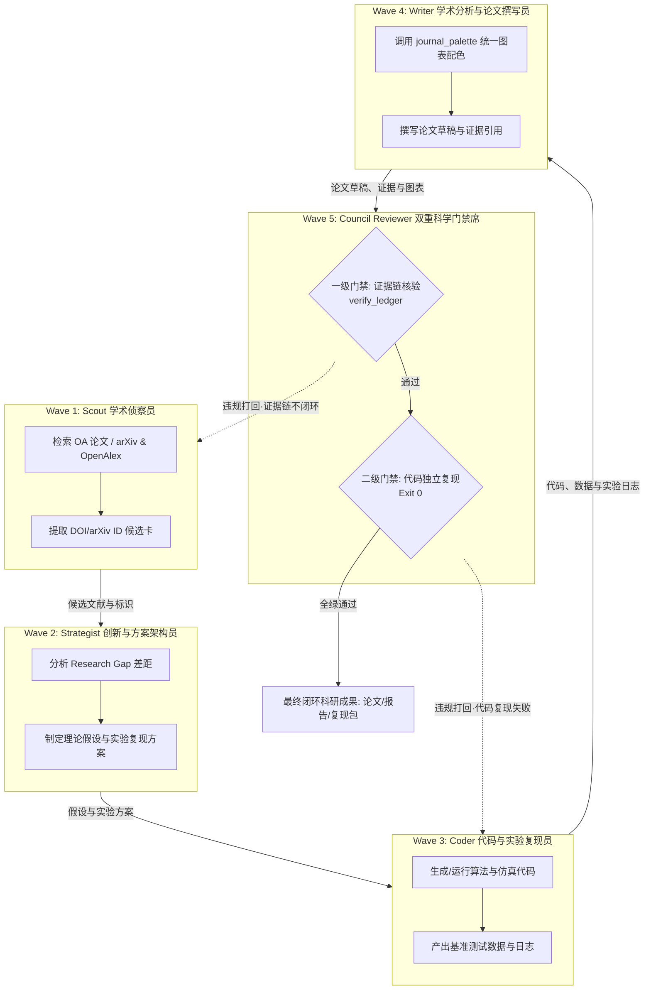

# Tianshu-Research 五阶段科研多 Agent 协作与 WorkOrder 规范模版

> 本模版吸收现代五层科研工作流架构，映射至 Tianshu-Harness 原生 `/team` 与 `/council` 编排器。
> **核心定位**：Tianshu-Harness 负责思考调度与多智能体分波；Tianshu-Research 提供专业工具网关、结构化证据账本（Evidence Ledger）与双重科学门禁（Scientific Gates）。

---

## 1. 五阶段闭环科研协作拓扑 (5-Phase Research Topology)

完整闭环工作流自上而下分为五个阶段：



---

## 2. 角色工单规范 (WorkOrder Specifications)

### Wave 1: Scout (学术检索与证据初筛员)
- **对应业务阶段**：问题与文献
- **目标 (Objective)**：围绕研究主题检索开放获取文献，提取标准标识（arXiv ID, DOI, OA URL），输出初筛候选卡。
- **工具集**：`research_query` (action: `search_papers`, `resolve_paper`)
- **交付要求**：
  1. 输出不超过 8 篇高相关文献列表，包含：题名、作者、发表年、DOI 或 arXiv ID、OA PDF 链接。
  2. 严禁使用通用 Web 搜索冒充学术文献。
- **验收指令**：
  ```text
  assert results.every(p => p.doi || p.arxivId)
  assert results.length >= 1 && results.length <= 8
  ```

### Wave 2: Strategist (创新与方案架构员)
- **对应业务阶段**：创新与方案
- **目标 (Objective)**：针对 Scout 提取的文献，分析 Research Gap，提炼核心创新点，提出可证伪的科学假设，并设计可复现的实验验证方案。
- **工具集**：宿主原生思考能力、`research_evidence` (action: `add_source`)
- **交付要求**：
  1. 输出方案文档落盘至 `.rivet/research/notes/research-proposal.md`。
  2. 明确定义：研究痛点、假设前提、量化指标、基准模型对比要求。
- **验收指令**：
  ```text
  assert file_exists(".rivet/research/notes/research-proposal.md")
  assert content.includes("假设") && content.includes("实验验证")
  ```

### Wave 3: Coder (代码与实验复现员)
- **对应业务阶段**：实验/代码验证
- **目标 (Objective)**：根据 Strategist 的方案生成数值算法与仿真复现脚本，通过宿主终端执行实验，保存基准测试数据与日志。
- **工具集**：宿主原生终端能力 (`bash` / `exec_command`)、`write_file`
- **交付要求**：
  1. 实验代码落盘至 `experiments/` 目录，确保有确定性随机数种子与清晰 CLI 参数。
  2. 运行脚本并将实验结果日志保存至 `experiments/logs/run.log`。
  3. 脚本执行退出码必须为 0。
- **验收指令**：
  ```text
  assert run_command("python experiments/run_benchmark.py") == 0
  assert file_exists("experiments/logs/run.log")
  ```

### Wave 4: Writer (学术分析与论文撰写员)
- **对应业务阶段**：分析与写作
- **目标 (Objective)**：基于实验数据与文献材料撰写论文章节草稿；调用 `journal_palette` 获取顶刊规范配色，生成符合出版要求的 Python 绘图脚本。
- **工具集**：`journal_palette`、`research_evidence` (action: `add_evidence`, `add_claim`, `export_csl_json`, `export_ris`)、宿主文件写入
- **交付要求**：
  1. 论文草稿落盘至 `manuscript/draft.md`。
  2. 生成 Matplotlib 绘图脚本并保存图表至 `figures/`。
  3. 将涉及的关键事实与数值写入证据账本，导出标准 CSL-JSON 与 RIS 文献格式。
- **验收指令**：
  ```text
  assert file_exists("manuscript/draft.md")
  assert file_exists(".rivet/research/export/literature.csl.json")
  assert file_exists(".rivet/research/export/literature.ris")
  ```

### Wave 5: Council Gatekeeper (审稿与质量控制席)
- **对应业务阶段**：审稿与双重质控
- **目标 (Objective)**：组织严谨独立的同行评审与双重科学门禁审查，严格阻止学术幻觉与无法复现的代码进入交付。
- **双重科学门禁**：
  - **一级门禁（证据链审查）**：调用 `research_evidence(action="verify_ledger", locatorThreshold=0.9)`。
    - 要求：100% Locator 覆盖，无未解析的悬空引用，全文 Grounding 摘录完全匹配，零严重错误。
  - **二级门禁（代码复现审查）**：在干净的执行环境中重新执行实验代码，对比生成指标是否一致。
    - 要求：脚本 Exit 0，输出关键数值指标在允许公差范围（RelDiff ≤ 1e-4）内。
- **闭环迭代机制**：
  - 若一级门禁未过：生成违规清单（缺失 Locator 或摘录不符），打回 Wave 1 / Wave 4 补齐证据。
  - 若二级门禁未过：生成报错堆栈与差异日志，打回 Wave 3 重新排查修复代码。
- **验收指令**：
  ```text
  assert verify_ledger().data.passed === true
  assert reproduce_experiment() === 0
  ```

---

## 3. 天枢原生 /team 编排 YAML 配置

用户可直接将以下配置作为天枢 Team 任务执行：

```yaml
team:
  name: "full-loop-research-team"
  description: "五阶段闭环科研协作多智能体团队"
  waves:
    - wave: 1
      name: "scout-wave"
      agents:
        - name: "scout"
          role: "academic_scout"
          tools: ["mcp__tianshu-research__research_query"]
          task: "围绕用户主题检索 3~5 篇高水平 OA 论文，提取真实 DOI 与 arXiv ID"

    - wave: 2
      name: "strategist-wave"
      agents:
        - name: "strategist"
          role: "research_architect"
          tools: ["write_file", "read_file"]
          task: "基于文献初筛分析 Research Gap，提炼创新假设与数值验证方案"

    - wave: 3
      name: "coder-wave"
      agents:
        - name: "coder"
          role: "experiment_engineer"
          tools: ["write_file", "exec_command"]
          task: "编写算法复现脚本并执行实验，将测试日志与指标落盘"

    - wave: 4
      name: "writer-wave"
      agents:
        - name: "writer"
          role: "scientific_writer"
          tools: ["mcp__tianshu-research__journal_palette", "mcp__tianshu-research__research_evidence", "write_file"]
          task: "使用顶刊色板生成图表，撰写论文章节，导出 CSL-JSON 与 RIS"

    - wave: 5
      name: "council-wave"
      agents:
        - name: "gatekeeper"
          role: "peer_reviewer"
          tools: ["mcp__tianshu-research__research_evidence", "exec_command"]
          task: "执行双重门禁：调用 verify_ledger 核验全部证据，复跑实验验证代码 Exit 0"
```

